Kaiburr Task 1 — Spring Boot + MongoDB

Author: Ashwanth GPN

Implements Task-1: Spring Boot API with MongoDB persistence, safe command execution, and execution history. Screenshots are embedded and include identity/time (Ashwanth GPN — $(Get-Date)).

Prerequisites

Java 17

Maven 3.9+

MongoDB Community (Windows service: MongoDB)

PowerShell or VS Code Terminal

Verify locally:

java -version
mvn -v
Get-Service MongoDB

How To Run:

# Start MongoDB if not running
Get-Service MongoDB | Where-Object {$_.Status -ne 'Running'} | Start-Service

# Build & run
mvn clean package -DskipTests
mvn --% -Dspring-boot.run.mainClass=com.ashwanth.kaiburr.KaiburrApplication spring-boot:run

Server: http://localhost:8080
If 8080 is busy, set in src/main/resources/application.yml:

server:
  port: 8081

API (base: http://localhost:8080/api)
Health
GET /health
→ 200 {"status":"ok","time":"..."}

Create/Update Task
PUT /tasks
Content-Type: application/json
Body:
{
  "name": "first-task",
  "owner": "Ashwanth",
  "command": "echo Hi"
}

List / Get by ID / Search by name
GET /tasks
GET /tasks?id=<TASK_ID>
GET /tasks?name=<query>

Run & Append Execution
PUT /tasks/{id}/executions
Content-Type: application/json
Body (optional): {"command":"echo Hello from exec"}

Delete
DELETE /tasks/{id}

Quick test (PowerShell)
# identity/time for screenshots
Write-Output "Ashwanth GPN — $(Get-Date)"

# health
Invoke-RestMethod -Uri "http://localhost:8080/api/health"

# create/update
Invoke-RestMethod -Method Put -Uri "http://localhost:8080/api/tasks" `
  -ContentType "application/json" `
  -Body '{"name":"first-task","owner":"Ashwanth","command":"echo Hi"}'

# list
Invoke-RestMethod -Uri "http://localhost:8080/api/tasks"

# by id
Invoke-RestMethod -Uri "http://localhost:8080/api/tasks?id=<TASK_ID>" | ConvertTo-Json -Depth 6

# search
Invoke-RestMethod -Uri "http://localhost:8080/api/tasks?name=first"

# run execution
Invoke-RestMethod -Method Put -Uri "http://localhost:8080/api/tasks/<TASK_ID>/executions" `
  -ContentType "application/json" `
  -Body '{"command":"echo Hello from exec"}'

# delete
Invoke-RestMethod -Method Delete -Uri "http://localhost:8080/api/tasks/<TASK_ID>"

Screenshots (embedded)

Every screenshot includes my identity/time.

Every screenshot includes my identity/time.

- `java -version`  
  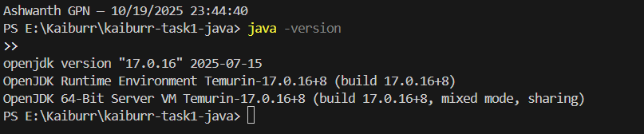

- `mvn -v`  
  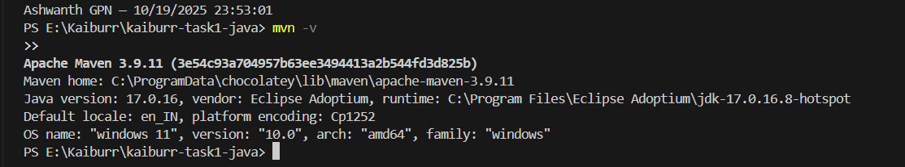

- `Get-Service MongoDB`  
  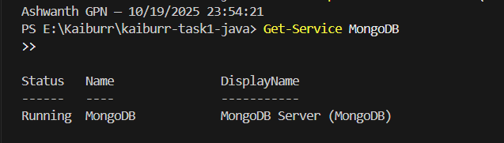

- App start (Tomcat on 8080)  
  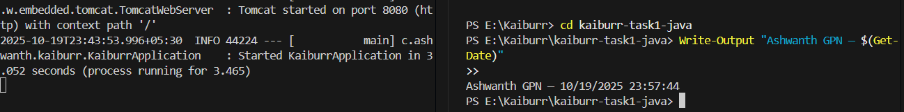

- `GET /api/health`  
  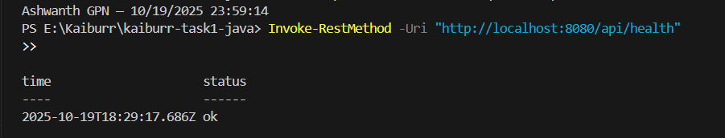

- `PUT /api/tasks`  
  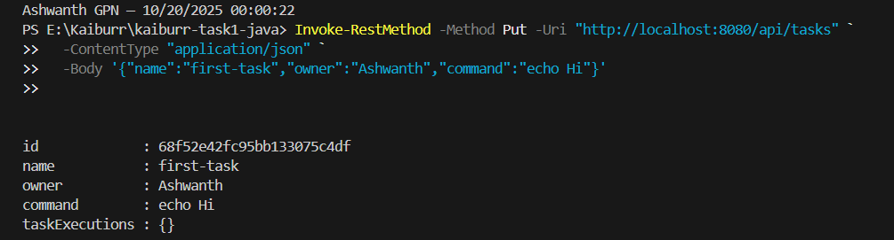

- `GET /api/tasks`  
  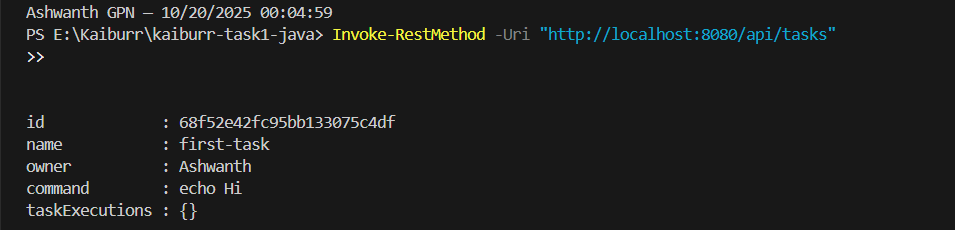

- `GET /api/tasks?id=...`  
  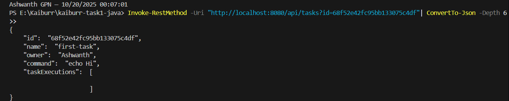

- `GET /api/tasks?name=...`  
  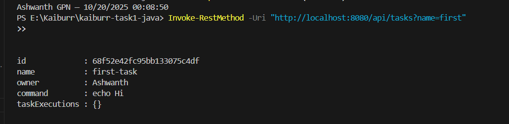

- `PUT /api/tasks/{id}/executions` (response)  
  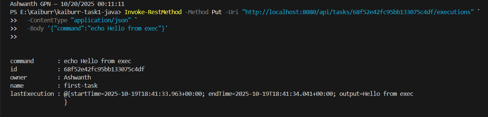

- Final `GET /api/tasks?id=...` showing `taskExecutions`  
  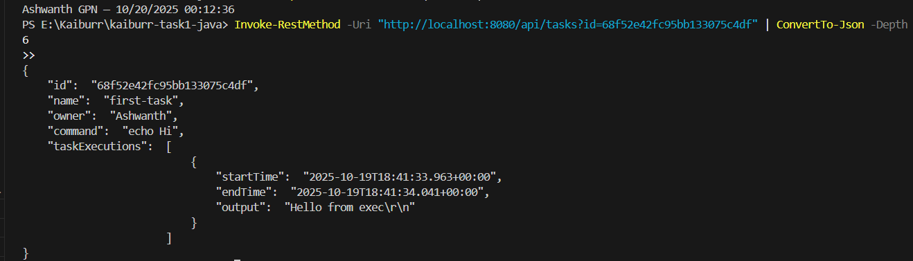

Data model
{
  "id": "string",
  "name": "string",
  "owner": "string",
  "command": "string",
  "taskExecutions": [
    { "startTime": "date", "endTime": "date", "output": "string" }
  ]
}

Command safety

Only a small allow-list is accepted (e.g., echo, java -version, mvn -v).
Anything else returns 400 Bad Request.