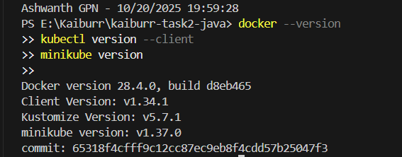
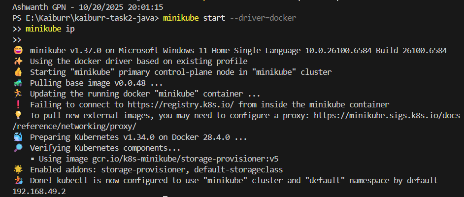

# 🚀 Kaiburr Task-2 — Spring Boot + Docker + Kubernetes

**Author:** Ashwanth GPN  

Implements **Task-2**: Spring Boot + MongoDB app deployed inside Kubernetes using Docker & Minikube with NodePort exposure, persistent PVC, and dynamic BusyBox executions.

---

## 🧰 Prerequisites

Install and verify:

- Java 17  
- Maven 3.9+  
- Docker Desktop  
- Minikube (Docker driver)  
- kubectl CLI  

docker --version
kubectl version --client
minikube version

📸 Screenshot:

⚙️ Step 1 — Start Minikube and Cluster Setup
minikube start --driver=docker
minikube ip

📸 Screenshot:

🧱 Step 2 — Deploy MongoDB and Application

Ensure your working directory is the project root:

cd E:\Kaiburr\kaiburr-task2-java

Apply manifests in sequence:

kubectl apply -f k8s/00-namespace.yaml
kubectl apply -f k8s/10-mongo-pvc.yaml
kubectl apply -f k8s/11-mongo-deploy.yaml
kubectl apply -f k8s/20-app-deploy.yaml

Check resources:

kubectl -n kaiburr get pods,svc
kubectl -n kaiburr get pvc

📸 Screenshots:

🐳 Step 3 — Build Docker Image

Build and tag the image for Kubernetes use:

docker build -t ashwanthgpn/kaiburr-task2:latest .

If needed, load into Minikube:

minikube image load ashwanthgpn/kaiburr-task2:latest

🌐 Step 4 — Access the Service

Expose the service URL:

minikube service -n kaiburr kaiburr-app --url

You’ll see something like:

http://127.0.0.1:55029

📸 Screenshot:

🧪 Step 5 — Test the APIs

Set your base URL:

$BASE = "http://127.0.0.1:55029"

🔹 Health Check
curl.exe "$BASE/api/health"

📸 Screenshot:

🔹 Create / Update Task
$r = Invoke-RestMethod -Method Put -Uri "$BASE/api/tasks" `
  -ContentType "application/json" `
  -Body '{"name":"k8s-task","owner":"Ashwanth","command":"echo Hi from K8s pod"}'
$ID = $r.id
$r

📸 Screenshot:

🔹 Run Execution (BusyBox Pod)

This executes a command inside a temporary pod and saves output to MongoDB.

Invoke-RestMethod -Method Put -Uri "$BASE/api/tasks/$ID/executions" `
  -ContentType "application/json" `
  -Body '{"command":"echo Hello from busybox"}'

📸 Screenshot:

🔹 Verify Execution History
Invoke-RestMethod -Uri "$BASE/api/tasks?id=$ID" | ConvertTo-Json -Depth 6

Expected output:

{
  "id": "68f64473d9b41f7531c6bf96",
  "name": "k8s-task",
  "owner": "Ashwanth",
  "command": "echo Hi from K8s pod",
  "taskExecutions": [
    {
      "startTime": "2025-10-20T14:17:23.940+00:00",
      "endTime": "2025-10-20T14:17:23.955+00:00",
      "output": "Hello from busybox\n"
    }
  ]
}

📸 Screenshot:

📦 Architecture Overview
Components
Component	Type	Description
Spring Boot API	Deployment	Exposes REST endpoints for managing tasks
MongoDB	Deployment + PVC	Persistent task storage
BusyBox Pod	Ephemeral Pod	Runs safe commands via K8s API
NodePort Service	Service	Exposes API on local Minikube URL
🧩 Data Model
{
  "id": "string",
  "name": "string",
  "owner": "string",
  "command": "string",
  "taskExecutions": [
    { "startTime": "date", "endTime": "date", "output": "string" }
  ]
}

🧠 Command Policy

To ensure safety, only a small allow-list of commands is accepted:

echo ...

java -version

mvn -v

Anything else returns:

{"error":"Command not allowed by policy"}

✅ Final Output Verification

All expected API responses were successful:

/api/health → OK

/api/tasks → Created/updated task

/api/tasks/{id}/executions → Ran BusyBox pod and captured output

/api/tasks?id={id} → Shows execution history stored in MongoDB

🏁 Conclusion

Task-2 completed successfully:
✔ Spring Boot app containerized
✔ MongoDB PVC in K8s
✔ REST APIs tested
✔ Commands executed inside BusyBox pod
✔ Output persisted and verified
